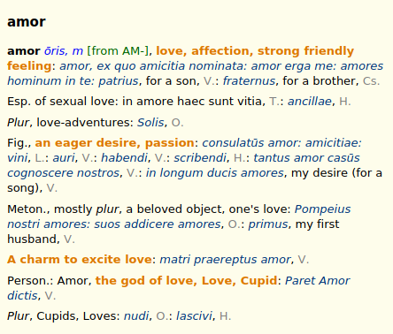
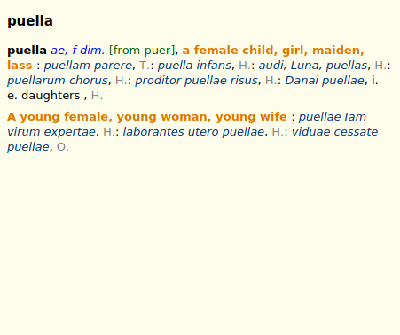

# {{ page.title }}, {{ page.author }} ({{ page.year }})

Classic **Latin**–**English** dictionary, younger brother of "[A Latin Dictionary]({{ site.baseurl }})" (Lewis & Short, 1879).

## Download

Current version is [v1.1 (February 20, 2020)][2]. Format Slob is recommended for GoldenDict, read [documentation]({{ site.baseurl }}) about other dictionary shells.

Additional formats (EPUB, Kindle) can be found on the [LLL website](http://www.litteraelatinae.eu/?p=381).

## Exemplum

<!--div class="spotlight-group" data-animation="" data-control="" data-autohide="false">
  
  
</div-->




# Sources

The dictionary was published in 1890, and transcribed in 1999:

1. Lewis, Ch. T. _An Elementary Latin Dictionary._ American Book Company, New York, Cincinnati, and Chicago, 1890.
1. Lewis, Ch. T; Crane G. (transcriber). _An Elementary Latin Dictionary._ Trustees of Tufts University, Medford, MA, 1999. URL: <https://github.com/PerseusDL/lexica/tree/master/CTS_XML_TEI/perseus/pdllex/lat/ls> \[Accessed 23 August 2019\].

# States and limitations

Quality of the TEI files is not high, incorrectly marked up articles are numerous.

## License

 This work is licensed under a <a rel="license" href="https://creativecommons.org/licenses/by-sa/3.0/us/">Creative Commons Attribution-ShareAlike 3.0 United States License</a>.

> Text provided by Perseus Digital Library, with funding from The National Endowment for the Humanities. Original version available for viewing and download at <http://www.perseus.tufts.edu/>

[1]: https://github.com/nikita-moor/latin-dictionary/tree/master/{{ page.nickname }}
[2]: https://github.com/nikita-moor/latin-dictionary/releases/tag/2020-02-20



