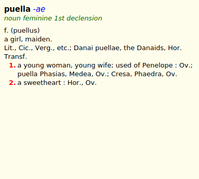
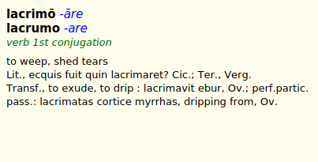

# {{ page.title }}, {{ page.author }} ({{ page.year }})

**Latin**–**English** college-level dictionary. Explanations are  clear, not overloaded with excessive citations or rare meanings. Digital edition contains only _Latin-English_ part of the book, and was supplemented with undefined number of articles from other sources. 

## Download

Current version is [v1.0 (August 23, 2019)][2]. Format Slob is recommended for GoldenDict, read [documentation]({{ site.baseurl }}) about other dictionary shells.

## Exemplum

<!--

  
  

-->




# Sources

1. Simpson D.P. _Cassell's Latin Dictionary._ New York: Simon & Schuster Macmillan Company, 1959.
2. Transcribed by Christ Kennedy ([@BadButBit][3]) as a part of his project "[Latin Textbook and Look-up Table in C#][4]".

# States and limitations

Basing on the information I know [about the source book][5], it was published before 1963, and its copyright was not renewed (checked in [Copyright Renewals database][6]). Therefore, now the book is in the Public Domain due to copyright expiration.

## License

This work is licensed under the [Code Project Open License][7] (CPOL).

[2]: https://github.com/nikita-moor/latin-dictionary/releases/tag/2019-08-23
[3]: http://latindiscussion.com/forum/latin/latin-project-app-free-to-download.31998/
[4]: https://www.codeproject.com/Articles/72737/Latin-Textbook-and-Look-up-Table-in-C
[5]: http://latindiscussion.com/forum/latin/latin-project-app-free-to-download.31998/#post-430837
[6]: https://exhibits.stanford.edu/copyrightrenewals
[7]: https://www.codeproject.com/info/cpol10.aspx



