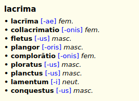

# {{ page.title }}, {{ page.author }} ({{ page.year }})

Dictionary of Latin synonyms “based on a similarity of meaning as established by the OLD” (see sources).

## Download

Current version is [v1.0 (January 14, 2020)][1]. Format Slob is recommended for GoldenDict, read [documentation][2] about other dictionary shells.

Dictionary is also available as an independent [Android application][4].

## Exemplum

<!--

    

-->



# Sources

1. Spinelli, Tommaso; Fenzi, Giacomo. _Online Dictionary of Latin Near-Synonyms._ St Andrews University, 2018. DOI:[10.17630/3cf644e6-86b8-44d0-a50a-b33c7ca86072](https://doi.org/10.17630/3cf644e6-86b8-44d0-a50a-b33c7ca86072).
1. Available from  GitHub repository: <https://github.com/tommasospinelli/Online-Dictionary-of-Latin-Near-Synonyms>.

## License

© Tommaso Spinelli. The author [gave permission][5] for distribution of the dictionary on our website.

[1]: https://github.com/nikita-moor/latin-dictionary/releases/tag/2020-01-14
[2]: {{ site.baseurl }}
[3]: https://github.com/nikita-moor/latin-dictionary/tree/master/{{ page.nickname }}
[4]: https://play.google.com/store/apps/details?id=com.apps.kolosowski.synonymum
[5]: https://github.com/tommasospinelli/Online-Dictionary-of-Latin-Near-Synonyms/issues/1

