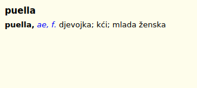

# {{ page.title }}, {{ page.author }} ({{ page.year }})

Latin-Croatian dictionary for use at schools. The book has the subtitle “I. dio: Latinsko-hrvatski rječnik”, so our version contains only Latin-Croatian part, and we have no information about the second volume.

## Download

Current version is [v1.1 (February 20, 2020)][1]. Format Slob is recommended for GoldenDict, read [documentation][2] about other dictionary shells.

## Exemplum

<!--

    

-->



# Sources

1. Žepić, Milan; Horvat-Žepić, Branka (editor). _Rječnik latinskoga i hrvatskoga jezika za školsku upotrebu. I. dio: Latinsko-hrvatski rječnik (3rd ed.)._ Zagreb, 1941. URL: <https://archive.org/details/zepic1941>.
1. Žepić, Milan; Boras, Damir; Jovanović, Neven. _Lexicon Latino-Croaticum, versio electronica._ (online) 2012. URL: <https://github.com/nevenjovanovic/zepic1941-lat-hrv>.

## States and limitations

Text of the transcript does not correspond exactly with the paper book: spelling of the words has been changed from “ijuv” to “iuv”, there are small additions and modifications in the text of the articles. Probably, corrections were made by the authors of the transcript, but we have no evidence.

## License

 This work is licensed under a <a rel="license" href="https://creativecommons.org/licenses/by/4.0/">Creative Commons Attribution 4.0 International License</a>.

[1]: https://github.com/nikita-moor/latin-dictionary/releases/tag/2020-02-20
[2]: {{ site.baseurl }}
[3]: https://github.com/nikita-moor/latin-dictionary/tree/master/{{ page.nickname }}

